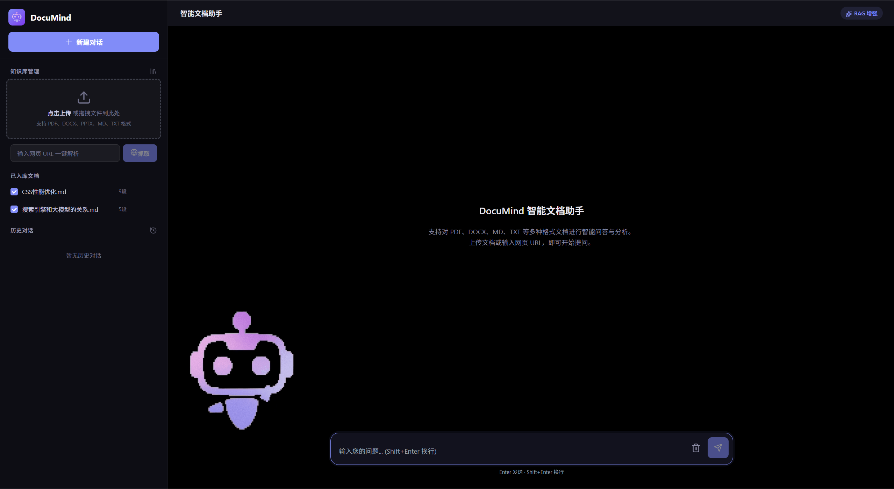

# 多格式文档与网页内容解析助手 Documind

基本样式展示

引入基本根据用户状态切换的gif

技术栈：
React（前端） + Python FastAPI（后端）+SQLite(嵌入式关系型数据库) + LangChain+ChromaDB(向量型数据库) + DeepSeek+ BGE/bge-small-zh（中文 Embedding 模型）

实现逻辑：
后端：将现有的 Python RAG 脚本封装成 RESTful API（例如暴露一个 /chat 接口，接收用户问题，返回 AI 答案） 数据存放在SQLite中 文本
前端：用React 搭建聊天页面，通过 fetch向后端发送请求并渲染返回的回答。

前端页面
侧边栏 + 主聊天区

## 侧边栏

1. 文件上传区：一个醒目的上传按钮或拖拽区域，支持批量上传 .pdf, .docx, .md, .txt 等文件。上传时最好带有进度条，解析成功后显示文件列表（带删除按钮）。
2. 网页抓取区：一个输入框，提示“输入网页 URL 一键解析”，旁边配一个“抓取”按钮。点击后前端显示加载状态，后端调用爬虫解析并入库。
3. 已入库文档列表：展示当前向量库（ChromaDB）中已存在的文档，用户可以在这里勾选或取消某些文档，实现“针对特定文档提问”。
   底部：展示历史对话记录，点击可切换不同的聊天上下文。

## 主聊天交互区

1. 右侧：主聊天交互区
   对话展示区（中间主体）：
   用户消息：通常靠右显示，使用区别于 AI 的背景色（如浅蓝色气泡）。
   AI 消息：靠左显示。由于实现了流式输出，这里添加一个动态的光标闪烁效果，文字会像打字机一样逐字浮现。

2. 引用溯源（RAG 特色）：在 AI 回答的下方或末尾，可以设计一个“参考来源”的小模块。点击可以展开查看 RAG 检索到的具体文档片段
底部输入区：
一个多行文本输入框（支持自动增高），支持 Shift + Enter 换行，Enter 发送。
发送按钮旁边放了一个“清空上下文”的图标，方便用户开启新的话题。

3. 流式输出的视觉反馈：
在 AI 回答时，输入框应该处于补充建议按钮(发现大模型跑偏)，或者发送按钮变为“停止生成”的方形图标(不需要回答时)。文字逐字打印时，建议配合平滑的滚动条，确保最新的回答始终在可视区域内。
加载与解析状态：
友好的 Loading 动画或进度提示（例如：“正在解析 PDF 文档...”、“正在将文本向量化并入库...”），避免用户以为页面卡死。

项目亮点：
多格式支持：不仅支持 TXT，还能批量加载 PDF、Word (.docx)、Markdown 等格式的文件。
网页抓取：可以直接传入一个 URL，自动抓取网页内容并解析成知识库。
流式输出：模仿 ChatGPT 的体验，让 AI 的回答逐字打印出来，提升交互流畅度。
中文优化：使用了专为中文优化的 BAAI/bge-small-zh-v1.5 模型来进行文本向量化（Embedding），能显著提升中文问答的准确度。
持久化向量库：使用 Chroma 数据库并将结果存盘，避免每次重启程序都重复计算向量，节省大量等待时间。
多轮对话与流式输出：支持上下文连贯的连续问答，且回答能像 ChatGPT 一样实时逐字打印，交互体验非常流畅。

理解核心流程：在做项目时，心里要时刻装着这个 RAG 的 6 步闭环：
文档加载 (读取 PDF/TXT) → 文本分片 (切成小块) → 文本向量化 (文字转数字) → 向量入库 (存入 Chroma/FAISS) → 相似性搜索 (用户提问时去库里找最相关的片段) → 大模型生成 (把片段和问题拼在一起让 AI 回答)。
